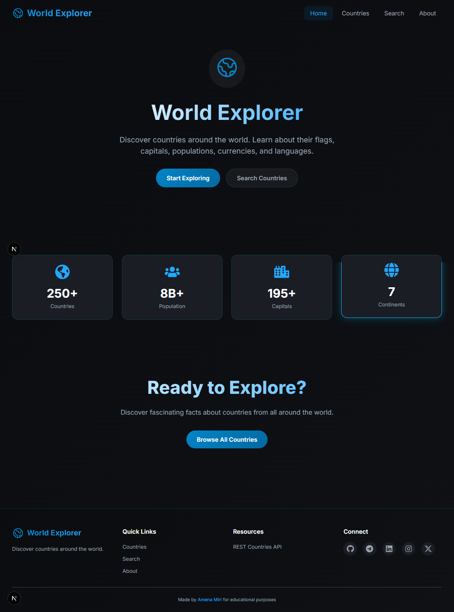
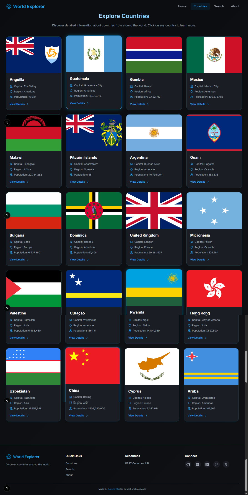
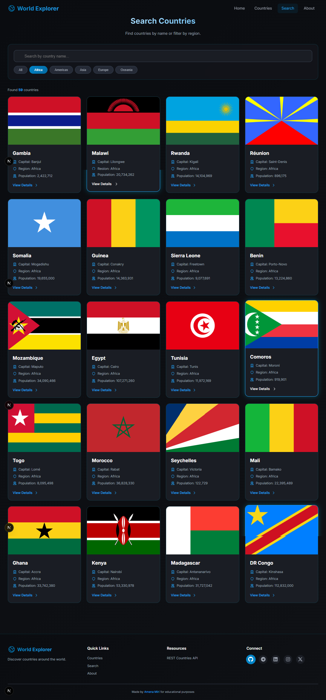
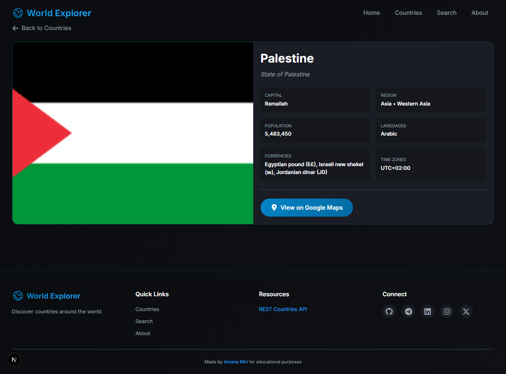
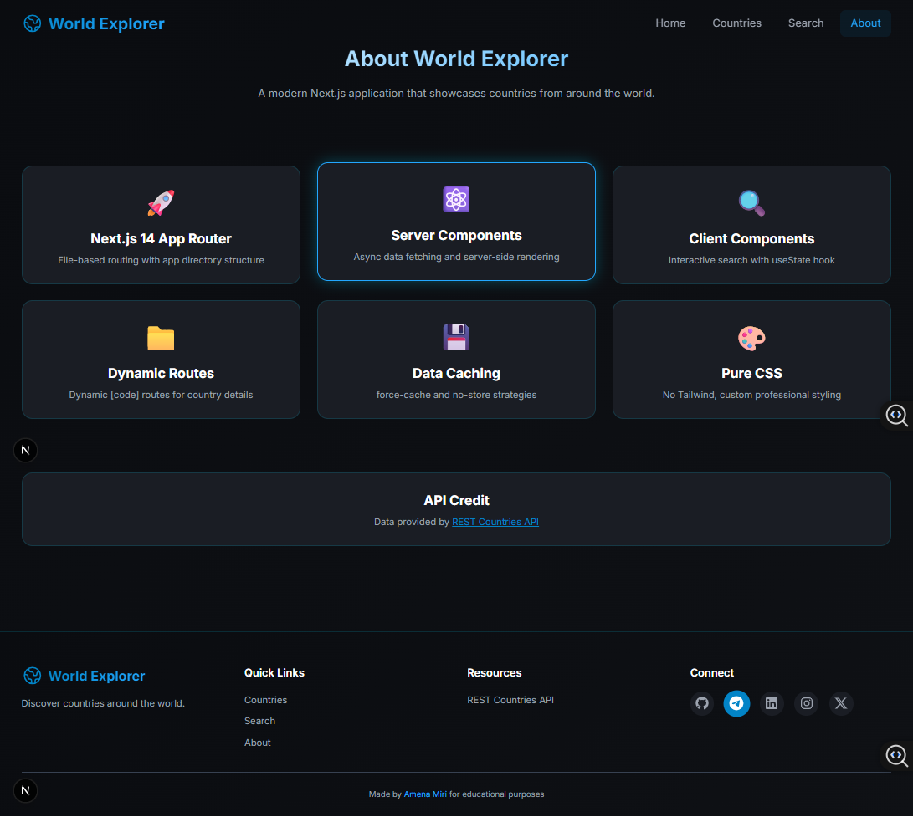

# 🌍 World Explorer

World Explorer is a modern **Next.js 14 App Router** project that allows users to explore countries around the world.  
Users can browse countries, search and filter them, and view detailed information about each country using data from the **REST Countries API**.

---

## 📌 Project Overview

This project demonstrates core Next.js concepts including:

- App Router structure
- File-based routing
- Server and Client Components
- Dynamic routes
- Data fetching with async/await
- Static and dynamic rendering
- Caching strategies (force-cache & no-store)
- Component reusability
- Responsive UI with pure CSS

---

## 🚀 Features

### 🌐 Country Explorer
- View a list of countries (at least 20 displayed)
- Country flag, name, capital, region, and population
- Click to view full country details

### 🔎 Search & Filter
- Search countries by name
- Filter countries by region (Asia, Europe, Africa, etc.)
- Real-time filtering using React state

### 📄 Country Details Page
Each country includes:
- Flag image
- Official name
- Capital city
- Region & subregion
- Population
- Languages
- Currencies
- Time zones
- Google Maps link

### 🎨 UI Features
- Responsive design (mobile-friendly)
- Hover effects on cards
- Clean modern layout
- Reusable components
- Loading & error handling pages

---

## 🧠 Tech Stack

- Next.js 14 (App Router)
- React (Client & Server Components)
- TypeScript
- CSS (Custom Styling)
- REST Countries API

---

## 🌍 API Used

### Get all countries
```txt
https://restcountries.com/v3.1/all
```

### Get single country
```txt
https://restcountries.com/v3.1/alpha/{code}
```

---

## 📁 Project Structure

```
world-explorer/
├── app/
│   ├── about/
│   ├── countries/
│   │   ├── [code]/
│   │   └── page.tsx
│   ├── search/
│   ├── globals.css
│   ├── layout.tsx
│   ├── loading.tsx
│   ├── not-found.tsx
│   └── page.tsx
│
├── components/
│   ├── CountryCard.tsx
│   ├── CountrySearch.tsx
│   ├── Navbar.tsx
│   ├── Footer.tsx
│
├── types/
│   └── country.ts
│
├── package.json
└── tsconfig.json
```

---

## 📄 Pages

### 🏠 Home Page `/`
- Hero section
- Welcome message
- Navigation links
- Button to explore countries

📸 Home Page Screenshot  


---

### 🌍 Countries Page `/countries`
- Fetches countries using `force-cache`
- Displays country cards
- Shows only first 20 countries
- Uses reusable `CountryCard` component

📸 Countries Page Screenshot  


---

### 🔎 Search Page `/search`
- Client component (`use client`)
- Search countries by name
- Filter by region
- Uses reusable country card UI

📸 Search Page Screenshot  


---

### 📌 Country Details `/countries/[code]`
- Dynamic route
- Fetch single country using API
- Uses `no-store` caching
- Displays full country information
- Includes Google Maps link
- Back navigation button

📸 Country Details Screenshot  


---

### ℹ️ About Page `/about`
- Explains project purpose
- Lists Next.js concepts used
- Shows API information

📸 About Page Screenshot  


---

## 🧩 Components

### Navbar
- Home
- Countries
- Search
- About

### Footer
- Visible on all pages
- Includes branding

### CountryCard
Reusable component displaying:
- Flag
- Name
- Capital
- Region
- Population
- View Details button

### CountrySearch
Client component with:
- Search input
- Region filter
- Dynamic filtering

---

## 🧪 How to Run Locally

```bash
git clone https://github.com/Amena-Miri/World-Explorer.git
cd world-explorer
npm install
npm run dev
```

Then open:

http://localhost:3000

---

## 👨‍💻 Author

<p align="center">
  <strong>Amena</strong><br/>
  Frontend Developer | React & Next.js Enthusiast
</p>

<p align="center">
  ⭐ If you liked this project, feel free to give it a star ⭐
</p>